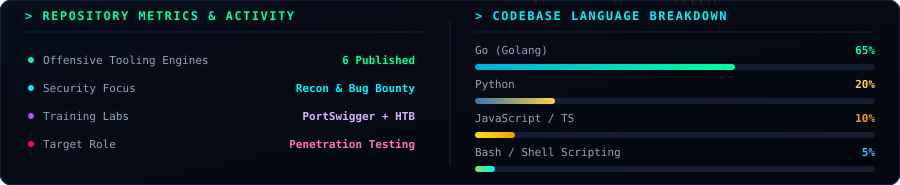
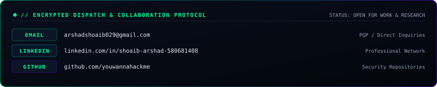
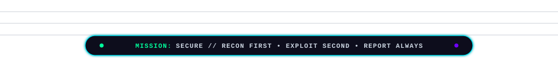

<!-- HERO ANIMATED CYBER BANNER -->

 

<!-- DYNAMIC TYPING TERMINAL -->

 

<!-- CYBER SOCIAL SHIELDS -->

  
  
  
  
  

<!-- PROFILE VIEW COUNTER -->

  

 

<!-- LASER DIVIDER -->

  

 

## 📡 System Diagnostic &amp; Operator Identity

Cybersecurity researcher and toolsmith engineering high-speed offensive-security software from first principles — focusing on **subdomain discovery**, **passive/active web spiders**, **heuristic attack-surface classifiers**, and **real-time CVE triage**. Currently advancing through **PortSwigger Web Security Academy** and **Hack The Box** while testing live bug bounty targets and preparing for Red Team / Penetration Testing opportunities.

 

<!-- ANIMATED INTERACTIVE TERMINAL -->

  

  

## ⚡ Technical Arsenal &amp; Weaponized Stack

<!-- ANIMATED SKILLS MATRIX -->

  

<!-- TECH ICON DOCK -->

  

<!-- OFFSEC SPECIALIZATION BADGES -->

  
  
  
  
  

  

## 🛠️ Weaponized Engines &amp; Featured Projects

<!-- ANIMATED PROJECTS SHOWCASE -->

 

| Target Engine | Core Tech | Architecture &amp; Capabilities | Status |
|---|:---:|---|:---:|
| ⚡ **[Subix](https://github.com/youwannahackme/subix)** | `Go` | Hybrid subdomain enumeration engine combining **68 passive OSINT sources** with active multi-threaded DNS resolution, dynamic wildcard filtering, and recursive scanning. |  |
| 🕷️ **[URLReeper](https://github.com/youwannahackme/urlreeper)** | `Go` | Hybrid web crawling &amp; spidering framework for security recon — merges passive discovery (Wayback, OTX, AlienVault) with high-speed active crawling. |  |
| 🎯 **[Vulncat](https://github.com/youwannahackme/vulncat)** | `Go` | Vulnerability-surface URL classifier for bug bounty hunting. Replaces flat regex matching with multi-signal heuristics, value-shape analysis, and REST API context awareness. |  |
| 🔥 **[RefleX](https://github.com/youwannahackme/RefleX)** | `Python` | High-performance concurrent scanner for reflected URL parameters and potential XSS, with case-insensitive matching and HTML-context severity scoring. |  |
| 🛡️ **[CVE Hunter Pro](https://github.com/youwannahackme/CVE-Hunter-Extention)** | `JavaScript` | Chrome extension for single-lookup CVE triage — CVSS scoring, EPSS exploit probability, CISA KEV status, and GitHub PoC discovery in one popup. |  |
| 🔍 **[ScriptSentry](https://github.com/youwannahackme/ScriptSentry-Extention)** | `JavaScript` | Chrome extension that monitors and lists every JS URL a page loads in real time, auto-categorized by risk with secret leak detection and a dark-mode UI. |  |

  

## 📊 Real-Time Telemetry &amp; Activity Velocity

<!-- LOCAL SELF-CONTAINED METRICS CARD (100% Uptime, Zero 503 Errors) -->

  

<!-- STREAK STATS WIDGET -->

  

## 🐍 Contribution Grid Radar

<!-- SNAKE ANIMATION -->

  ⚡ Automatically compiled by <b>GitHub Actions</b> on a 6-hour cron schedule.

  

## 🤝 Connect &amp; Secure Collaboration

<!-- ANIMATED CYBER DISPATCH CARD -->

  

<!-- DIRECT INTERACTIVE CONTACT BUTTONS -->

  
  &nbsp;&nbsp;
  
  &nbsp;&nbsp;
  

 

<!-- LASER DIVIDER -->

  

 

<!-- ANIMATED CYBER FOOTER -->

